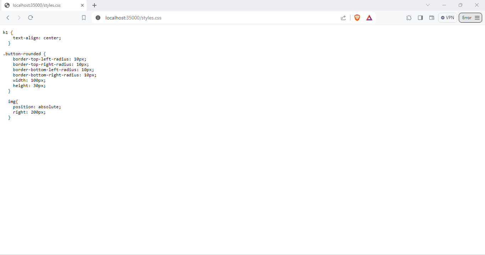
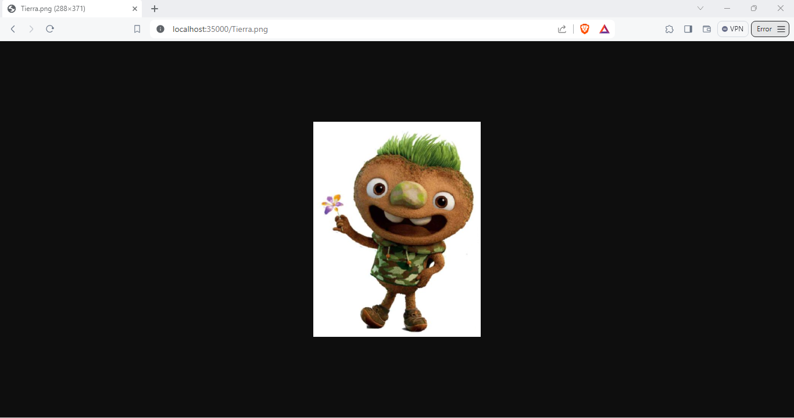

# TALLER 2: DISEÑO Y ESTRUCTURACIÓN DE APLICACIONES DISTRIBUIDAS EN INTERNET

En la siguiente aplicación, se ha implementado un servidor web capaz de gestionar múltiples solicitudes de forma secuencial (no concurrente). Este servidor tiene la capacidad de leer y devolver archivos almacenados en el disco local, abarcando formatos como HTML, JavaScript, CSS y archivos de imagen en formato PNG.
Además, se ha desarrollado una página web simple que cumple con todos los requisitos mencionados anteriormente y se incorporó la aplicación REST del [Taller 1](https://github.com/AREP-2024/Taller1.git)  para proporcionar una experiencia integral y funcional.


### Prerrequisitos

Los prerrequisitos tecnológicos que necesita este taller son:

* [Maven](https://maven.apache.org/): Maven es un herramienta que proporciona una estructura estándar, gestión de dependencias y automatización de tareas en los proyectos software desarrollados en Java.

* [GitHub](https://platzi.com/blog/que-es-github-como-funciona/): Es una plataforma de desarrollo colaborativo basado en Git que utiliza un sistema de versiones distribuida para el seguimiento del código fuente durante el desarrollo. 

### Instalación

1.  Clone el repositorio:
```
git clone https://github.com/AREP-2024/Taller2.git
```

2. Acceda al repositorio que acaba de clonar:
```
cd Taller2
```
3. Se hace la construcción del proyecto:
```
mvn package
```
### Corriendo 

Ahora de debe poner a ejecutar el servidor:

#### Windows

```
 mvn exec:java -"Dexec.mainClass"="edu.escuelaing.arep.ASE.app.HttpServer"
```

#### Linux/MacOs

```
 mvn exec:java -Dexec.mainClass="edu.escuelaing.arep.ASE.app.HttpServer"
```
* Por último accede desde cualquier browser con la siguiente URL:

```
http://localhost:35000/
```

Que lo llevara a consultar la API REST construida en el Taller1:


**Un adicional que tiene este aplicativo web es que si usted desea observar únicamente los JSON que genera la API REST lo podrá hacer de la siguiente manera:**

```
http://localhost:35000/Peliculas/nombrePelicula
```
No olvide remplazar donde dice **nombrePelicula** por el nombre de la película de desea buscar ejemplo: 
```
http://localhost:35000/Peliculas/Barbie
```
Imagen


* Si usted desea ver la pagina web que se construyo con: HTML, JavaScript, CSS y que además tiene una imagen use la siguiente URL:

```
http://localhost:35000/mokepon.html
```
Imagen


**Pero si lo que usted desea es observar cada uno de los documento que conforman la pagina web haga uso de las siguiente:**

* Para ver documento JavaScript use la siguiente URL:
```
http://localhost:35000/mokepon.js
```
Imagen


* Para ver el documento CSS use la siguiente URL:
```
http://localhost:35000/styles.css
```
Imagen


* Para poder observar la imagen use la siguiente URL:
```
http://localhost:35000/Tierra.png
```
Imagen


* Si usted le ingreso al servidor web el nombre de una archivo que no se encuentra en el servidor local este la mandara un error 404 como se muestra en la siguiente imagen: 


### Construido con

* [Maven](https://maven.apache.org/): Maven es un herramienta que proporciona una estructura estándar, gestión de dependencias y automatización de tareas en los proyectos software desarrollados en Java.

* [GitHub](https://platzi.com/blog/que-es-github-como-funciona/): Es una plataforma de desarrollo colaborativo basado en Git que utiliza un sistema de versiones distribuida para el seguimiento del código fuente durante el desarrollo. 

* [Visual Studio Code](https://code.visualstudio.com/):Es un entorno de desarrollo integrado (IDE) ligero y de código abierto desarrollado por Microsoft

* [Java 17](https://www.java.com/es/download/help/whatis_java.html): Es un lenguaje de programación de propósito general, orientado a objetos y diseñado para ser independiente de la plataforma. 

* [HTML](https://developer.mozilla.org/es/docs/Web/HTML): Es el lenguaje de marcado que se utiliza para crear páginas web. Se define como un conjunto de etiquetas que se utilizan para estructurar y dar significado al contenido de una página web.

* [JavaScript](https://aws.amazon.com/es/what-is/javascript/): Es un lenguaje de programación de alto nivel, interpretado y orientado a objetos. Se utiliza principalmente en el desarrollo web para crear páginas web interactivas y dinámicas

* [CSS](https://lenguajecss.com/css/introduccion/que-es-css/) : Es un lenguaje de diseño utilizado para definir como se deben mostrar los elementos de una página web.

### Autor
[Luisa Fernanda Bermudez Giron](https://www.linkedin.com/in/luisa-fernanda-bermudez-giron-b84001262/) - [Luisa Fernanda Bermudez Giron](https://github.com/LuisaGiron)

### Licencias 

**©** Luisa Fernanda Bermudez Giron, Estudiante de Ingeniería de Sistemas de la Escuela Colombiana de Ingeniería Julio Garavito.